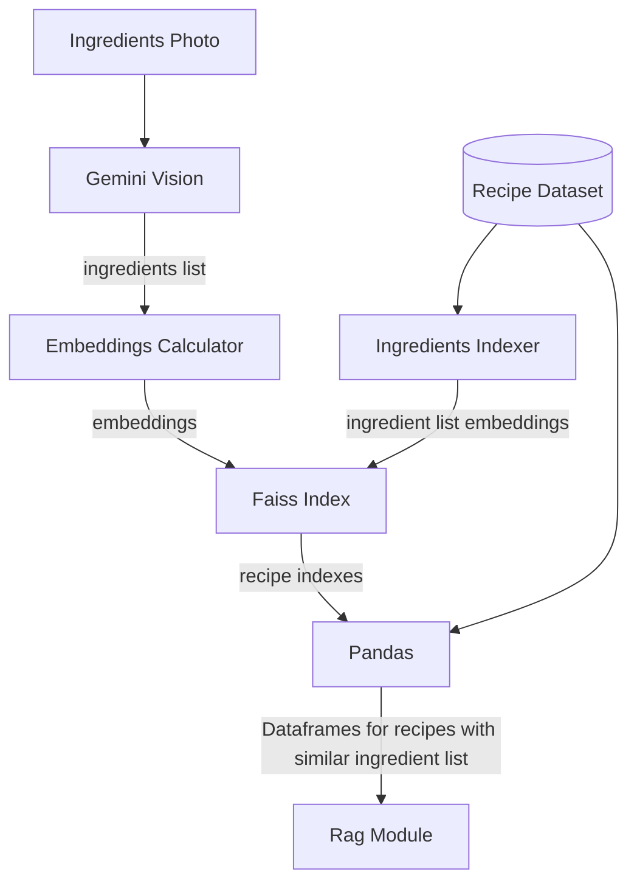

# Architecture

```mermaid
flowchart TD
    Photo[Ingredients Photo]
    Gemini[Gemini Vision]
    Photo --> Gemini 
    
    EC[Embeddings Calculator]
    Gemini -- ingredients list --> EC  
    Faiss[Faiss Index]
    EC -- embeddings --> Faiss
    Faiss -- recipe indexes --> Pandas
    Dataset[(Recipe Dataset)]
    IngredientsIndexer[Ingredients Indexer]
    Pandas[Pandas]
    Dataset -->Pandas
    Dataset --> IngredientsIndexer
    IngredientsIndexer --ingredient list embeddings--> Faiss
    RagModule[Rag Module]
    Pandas -- Dataframes for recipes with similar ingredient list --> RagModule
   
    RagModule 
    
```