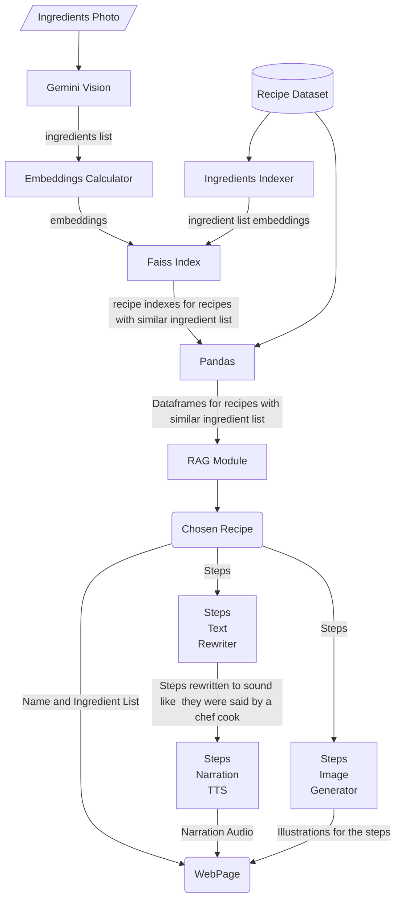

# Architecture

## Data flow

```mermaid
flowchart TD
    Photo[/Ingredients Photo/]
    Gemini[Gemini Vision]
    Photo --> Gemini 
    
    EC[Embeddings Calculator]
    Gemini -- ingredients list --> EC  
    Faiss[Faiss Index]
    EC -- embeddings --> Faiss
    Faiss -- recipe indexes for recipes with similar ingredient list --> Pandas
    Dataset[(Recipe Dataset)]
    IngredientsIndexer[Ingredients Indexer]
    Pandas[Pandas]
    Dataset -->Pandas
    Dataset --> IngredientsIndexer
    IngredientsIndexer --ingredient list embeddings--> Faiss
    RagModule[RAG Module]
    Pandas -- Dataframes for recipes with similar ingredient list --> RagModule
    RagModule 
    Recipe(Chosen Recipe)
    RagModule --> Recipe
    ImageGen[Steps
    Image 
    Generator
    ]
    NarrationGen[
    Steps
    Narration 
    TTS
    ]
    Rewriter[
     Steps
     Text
     Rewriter
    ]
    Recipe -- Steps --> ImageGen
    Recipe -- Steps --> Rewriter
    Rewriter -- Steps rewritten to sound like  they were said by a chef cook--> NarrationGen
    WebPage(WebPage)
    Recipe -- Name and Ingredient List--> WebPage
    NarrationGen -- Narration Audio --> WebPage
    ImageGen -- Illustrations  for the steps--> WebPage
    
```